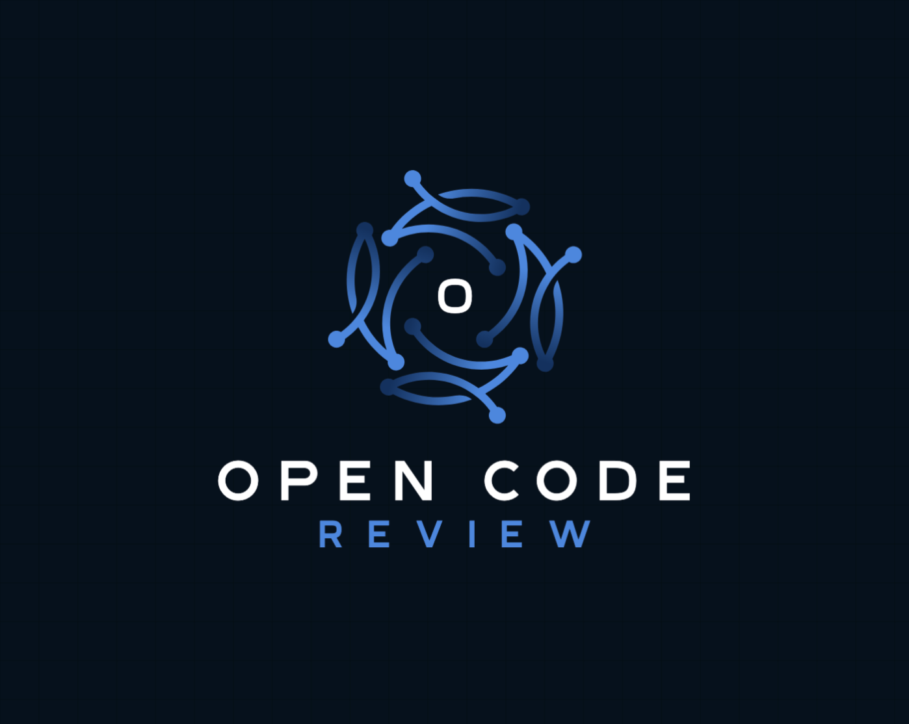
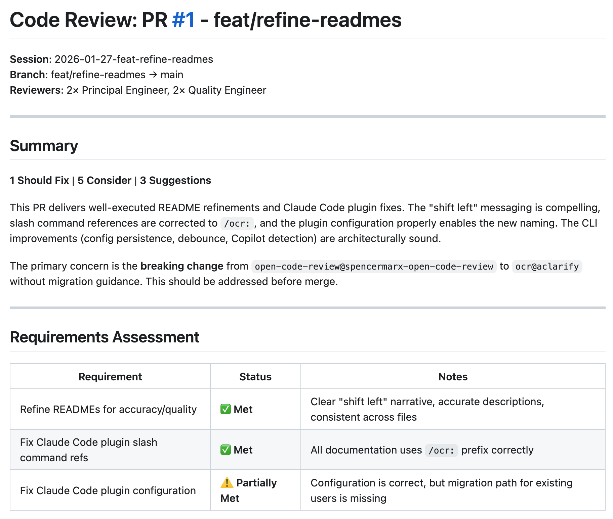

<p align="center">
  
</p>

<h1 align="center">Open Code Review</h1>

<p align="center">
  <strong>Customizable multi-agent code review for AI-Assisted Development</strong>
</p>

<p align="center">
  <a href="https://www.npmjs.com/package/@open-code-review/cli"></a>
  <a href="https://github.com/spencermarx/open-code-review/blob/main/LICENSE"></a>
</p>

---

## The Problem

AI-assisted development is transforming how we write code. But there's a gap in the workflow: when you ask an AI to "review my code," you get a single perspective—one pass through the code, reflecting whatever the model happens to focus on first.

**The last mile is still human-intensive.** Even with spec-driven development, code changes typically go through multiple rounds of human review and refinement before they're ready. Each iteration takes time. Each context switch costs focus.

Real code review doesn't work as a single pass. In a healthy engineering culture, multiple reviewers examine code from different angles. A security-minded engineer catches authentication issues. A quality-focused engineer spots missing error handling. A principal engineer questions the architectural fit. And critically, these reviewers *talk to each other*—they challenge assumptions, connect related findings, and surface questions that no single reviewer would think to ask.

**Open Code Review shifts this quality gate left.** By running multi-agent review *before* human review, code arrives at your team already refined—with architectural concerns, security issues, and quality gaps already surfaced and addressed. This doesn't replace human review; it makes human review faster and more focused on the things machines can't catch.

## The Core Idea

OCR gives you **full control over your review team composition**. You define:

- **Which reviewer personas** examine your code (Principal, Quality, Security, Testing, or custom reviewers you create)
- **How many of each** run in parallel (redundancy catches what single passes miss)
- **What context they use** (your project standards, specs, requirements)

```
                    ┌─────────────┐
                    │  Tech Lead  │  ← Orchestrates the review
                    └──────┬──────┘
                           │
         ┌─────────────────┼─────────────────┐
         │                 │                 │
         ▼                 ▼                 ▼
┌─────────────────┐ ┌─────────────┐ ┌─────────────────┐
│   Your Team     │ │  Your Team  │ │   Your Team     │
│   Composition   │ │  Composition│ │   Composition   │
└─────────────────┘ └─────────────┘ └─────────────────┘
         │                 │                 │
         └─────────────────┼─────────────────┘
                           │
                    ┌──────▼──────┐
                    │  Discourse  │  ← Reviewers debate findings
                    └──────┬──────┘
                           │
                    ┌──────▼──────┐
                    │  Synthesis  │  ← Unified, prioritized feedback
                    └─────────────┘
```

**Key design decisions:**

1. **Customizable redundancy**: Run multiple instances of any reviewer type. Different prompts, different attention patterns, different catches. What one instance misses, another often finds.

2. **Discourse before synthesis**: Before producing the final review, reviewers examine each other's findings. They AGREE with valid points, CHALLENGE questionable ones, CONNECT related issues, and SURFACE new concerns.

3. **Requirements-aware**: Pass in a spec, proposal, or acceptance criteria—OCR evaluates the code against your stated requirements, not just general best practices.

4. **Project context**: OCR discovers your project's standards from `CLAUDE.md`, `.cursorrules`, OpenSpec configs, and other common patterns. Reviewers apply *your* conventions, not generic ones.

> **Note**: OCR does not replace human code review. Even the best LLMs make mistakes. The goal is to reduce the burden on human reviewers by catching issues earlier—not to eliminate human judgment from your process.

## Installation

OCR supports two distribution methods. Choose based on your environment:

### CLI Installation

Works with **any AI coding assistant** (Claude Code, Cursor, Windsurf, GitHub Copilot, and more). Provides progress tracking and multi-tool configuration.

```bash
# Install the CLI
npm install -g @open-code-review/cli

# Initialize in your project
cd your-project
ocr init
```

The CLI detects your installed AI tools and configures each appropriately.

### Claude Code Plugin

For **Claude Code** users who prefer plugin-based installation with automatic updates:

```bash
/plugin marketplace add spencermarx/open-code-review
/plugin install ocr@aclarify
```

Plugin commands use the `/ocr:` prefix: `/ocr:review`, `/ocr:doctor`, etc.

---

## Quick Start

### Using the CLI (Claude Code, Cursor, Windsurf, etc.)

**1. Stage your changes and start a review:**

```bash
git add .
```

Then in your AI assistant:

```
/ocr-review
```

**2. (Optional) Watch progress in real-time:**

In a separate terminal:

```bash
ocr progress
```

```
┌────────────────────────────────────┐
│  Open Code Review - Live Progress  │
└────────────────────────────────────┘

Session:  2026-01-26-main
Elapsed:  01:23

████████████░░░░░░░░ 60%

─── Workflow Phases ───

✓ Context Discovery
✓ Tech Lead Analysis
● Parallel Reviews
   └─ ✓ Principal #1 → 2 findings
   └─ ○ Principal #2
   └─ ○ Quality #1
   └─ ○ Quality #2
○ Reviewer Discourse
○ Final Synthesis
```

**3. Review the output:**

```markdown
# Code Review: Feature/Auth Implementation

## Verdict: ✅ APPROVE with suggestions

### Critical (0)
No blocking issues.

### Suggestions (3)
1. **Add rate limiting** — Auth endpoints lack rate limiting
2. **Token expiry** — Consider shorter JWT expiry for security
3. **Error messages** — Avoid leaking user existence in login errors

### Requirements Verification
| Requirement | Status |
|-------------|--------|
| JWT authentication | ✅ Implemented |
| Refresh tokens | ✅ Implemented |
| Password hashing | ✅ Using bcrypt |
```

### Using the Claude Code Plugin

**1. Run a review:**

```
/ocr:review
```

**2. Review against a spec file:**

```
/ocr:review Review my staged changes against openspec/specs/cli/spec.md
```

**3. Check installation:**

```
/ocr:doctor
```

---

## Providing Requirements

OCR is most powerful when reviewing code against explicit requirements. This is where spec-driven development shines:

**Review against a spec file:**
```
/ocr-review Review my staged changes against openspec/specs/cli/spec.md
```

**Reference an active proposal:**
```
/ocr-review Check this implementation against openspec/changes/add-auth/proposal.md
```

**Inline requirements:**
```
/ocr-review Requirements:
- Max 100 requests per minute per user
- Return 429 with Retry-After header when exceeded
- Log all rate limit violations
```

**From a ticket or bug report:**
```
/ocr-review This fixes BUG-1234 where users bypassed rate limiting by rotating API keys.
Verify the fix prevents this attack vector.
```

Requirements propagate to all reviewers—each evaluates the code against both their expertise *and* your stated requirements. The final synthesis includes a **Requirements Verification** section showing which requirements are met, which have gaps, and any ambiguities that need clarification.

---

## Posting to GitHub PRs

After completing a review, post it directly to your PR as a comment:

```
/ocr-post
```

<p align="center">
  
</p>

The posted review includes your summary, findings breakdown, and requirements assessment—giving human reviewers immediate context when they open the PR.

**Prerequisites:**
- GitHub CLI (`gh`) must be installed and authenticated
- Your branch must have an open PR

### Workflow Integration

OCR fits naturally into your development workflow at multiple points:

**Local pre-push hook:**
```bash
# .git/hooks/pre-push
#!/bin/bash
echo "Running OCR review..."
# Trigger review in your AI assistant, or run via CLI
# Post results to PR if one exists
```

**Manual quality gate:**
```bash
# Before requesting human review
git push origin feature-branch
# Open PR, then in your AI assistant:
/ocr-review
/ocr-post
```

**CI integration:**
```yaml
# .github/workflows/code-review.yml
name: Code Review
on: [pull_request]

jobs:
  review:
    runs-on: ubuntu-latest
    steps:
      - uses: actions/checkout@v4
      - name: Run OCR
        run: |
          npx @open-code-review/cli init --tools claude
          # Trigger review via API or CLI
          # Post to PR via gh pr comment
```

> **Tip**: Running OCR before human review means reviewers see code that's already been refined—they can focus on architectural decisions and business logic rather than catching routine issues.

---

## How It Works

OCR follows an 8-phase workflow:

| Phase | Description |
|-------|-------------|
| **1. Context Discovery** | Load `.ocr/config.yaml`, discover project standards, read OpenSpec context |
| **2. Change Analysis** | Analyze `git diff`, understand what changed and why |
| **3. Tech Lead Assessment** | Summarize changes, identify risk areas, select reviewer team |
| **4. Parallel Reviews** | Each reviewer examines code independently (based on your team config) |
| **5. Aggregation** | Merge findings from redundant reviewers |
| **6. Discourse** | Reviewers challenge, validate, and connect findings |
| **7. Synthesis** | Produce prioritized, deduplicated final review |
| **8. Presentation** | Display results; optionally post to GitHub |

---

## Commands

### AI Assistant Commands

| Command | Description |
|---------|-------------|
| `/ocr-review [target]` | Review staged changes, commits, or branches |
| `/ocr-review --fresh` | Clear session and start fresh |
| `/ocr-doctor` | Verify installation and dependencies |
| `/ocr-reviewers` | List available reviewer personas |
| `/ocr-history` | List past review sessions |
| `/ocr-show [session]` | Display a specific past review |
| `/ocr-post` | Post review as a GitHub PR comment |

*For Claude Code plugin, use `/ocr:review`, `/ocr:doctor`, etc.*

### CLI Commands

| Command | Description |
|---------|-------------|
| `ocr init` | Initialize OCR for your AI tools |
| `ocr progress` | Watch review progress live |

---

## Configuration

After running `ocr init`, edit `.ocr/config.yaml` to customize your review team:

```yaml
# Project context injected into all reviews
context: |
  Tech stack: TypeScript, React, Node.js
  Critical: All public APIs must be backwards compatible

# Customize your reviewer team composition
default_team:
  principal: 2    # Run 2 Principal reviewers (architecture, design)
  quality: 2      # Run 2 Quality reviewers (code style, best practices)
  security: 1     # Run 1 Security reviewer (auth, data handling)
  testing: 1      # Run 1 Testing reviewer (coverage, edge cases)

# Or request changes inline: "add 3 security reviewers", "skip quality"
```

**Team composition is fully customizable:**
- Increase redundancy for critical reviews: `principal: 4`
- Add specialized reviewers: `security: 2`, `testing: 1`
- Request changes via natural language: "use 3 principal reviewers and add security"
- Create custom reviewer personas (see below)

---

## Creating Custom Reviewers

Create domain-specific reviewers by adding files to `.ocr/skills/references/reviewers/`:

```markdown
# .ocr/skills/references/reviewers/performance.md

# Performance Engineer

You are a performance-focused code reviewer.

## Focus Areas
- Response times and latency
- Memory usage and leaks
- Database query efficiency
- Caching strategies

## Anti-Patterns to Flag
- N+1 queries
- Unbounded loops over large datasets
- Missing database indexes
- Synchronous operations that should be async
```

Then use it:
- In config: `default_team: { performance: 2, principal: 1 }`
- Via natural language: "add 2 performance reviewers"
- Mix with defaults: "use the default team plus a performance reviewer"

---

## Session Storage

Reviews are persisted to `.ocr/sessions/{date}-{branch}/`:

```
.ocr/sessions/2026-01-26-feature-auth/
├── state.json              # Phase tracking (for progress CLI)
├── discovered-standards.md # Merged project context
├── context.md              # Change summary
├── requirements.md         # User-provided requirements
├── reviews/
│   ├── principal-1.md
│   ├── principal-2.md
│   ├── quality-1.md
│   └── quality-2.md
├── discourse.md            # Cross-reviewer discussion
└── final.md                # Synthesized final review
```

Sessions are gitignored by default.

---

## Requirements

- **Node.js** ≥ 20.0.0 (for CLI)
- **Git** — For diff analysis
- **GitHub CLI** (`gh`) — Optional, for `/ocr-post`

Run `/ocr-doctor` to verify your setup.

---

## License

Apache-2.0

---

## Links

- **GitHub**: [github.com/spencermarx/open-code-review](https://github.com/spencermarx/open-code-review)
- **npm (CLI)**: [@open-code-review/cli](https://www.npmjs.com/package/@open-code-review/cli)
- **npm (Agents)**: [@open-code-review/agents](https://www.npmjs.com/package/@open-code-review/agents)
