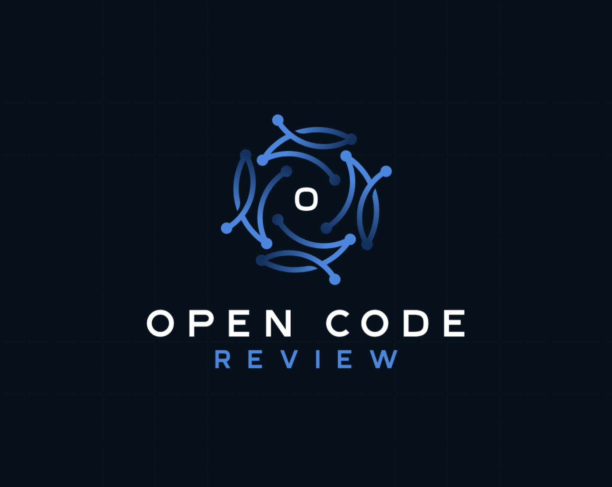
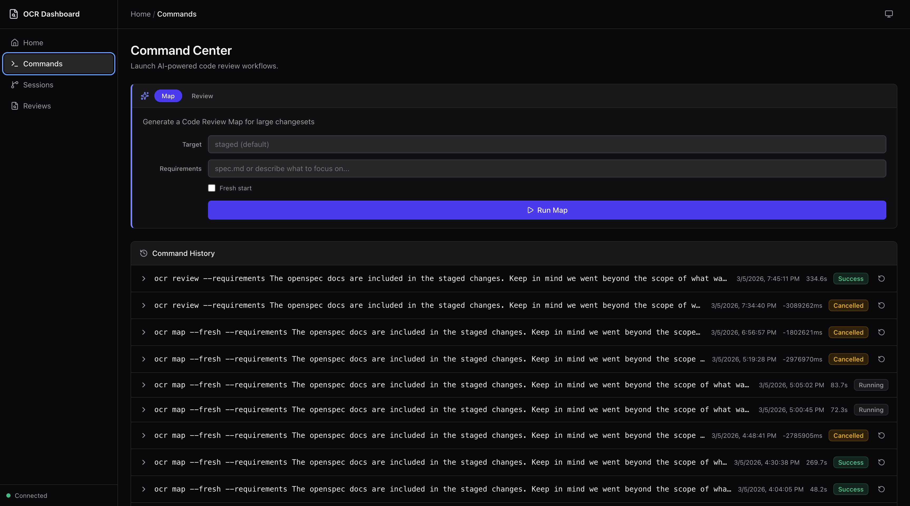
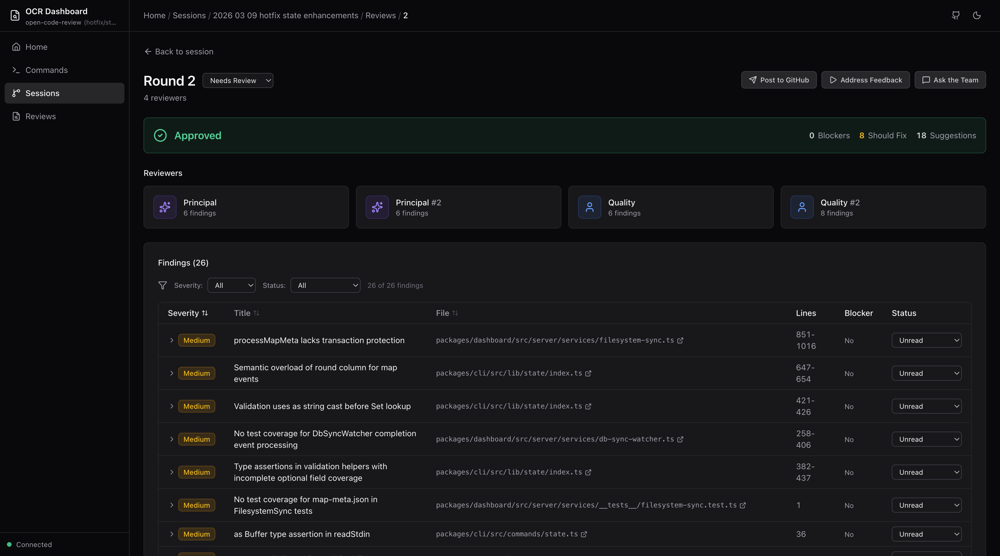
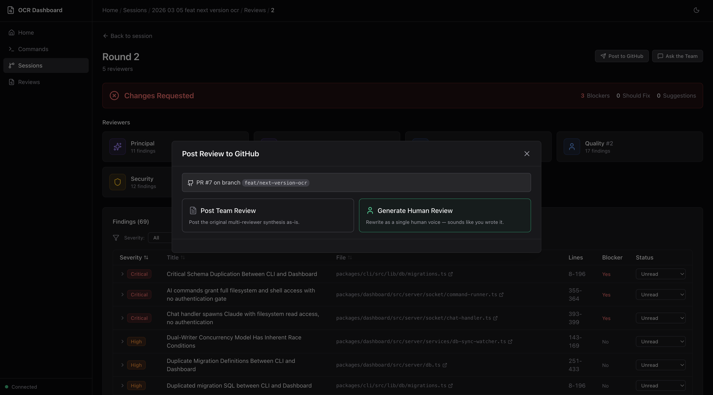
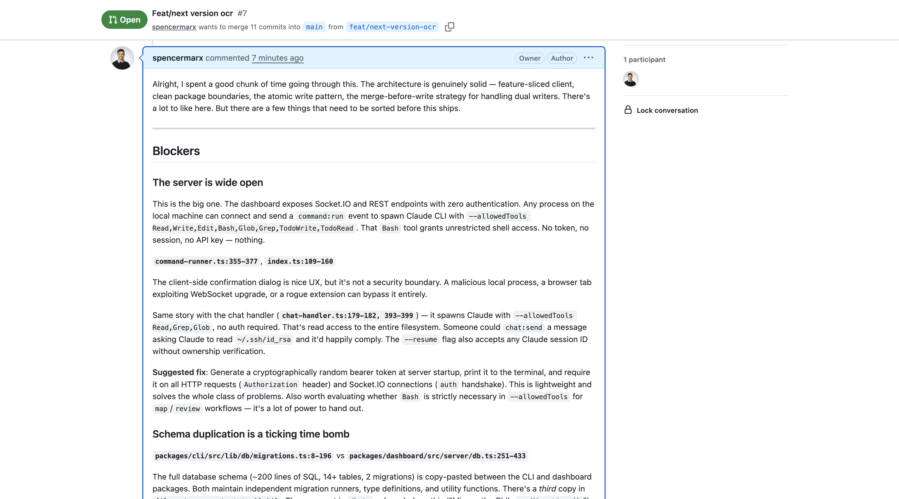

<p align="center">
  
</p>

<h1 align="center">Open Code Review</h1>

<p align="center">
  <strong>Customizable multi-agent code review for AI-assisted development</strong>
</p>

<p align="center">
  <a href="https://www.npmjs.com/package/@open-code-review/cli"></a>
  <a href="https://github.com/spencermarx/open-code-review/blob/main/LICENSE"></a>
</p>

---

## Quick Start

```bash
# 1. Install the CLI globally
npm install -g @open-code-review/cli

# 2. Initialize OCR in your project
cd your-project
ocr init

# 3. Launch the dashboard and run your first review
ocr dashboard
```

`ocr init` detects your installed AI tools (Claude Code, Cursor, Windsurf, and [11 more](#supported-ai-tools)) and configures each one automatically. Then open the dashboard to run a review, browse results, and manage your workflow from the browser.

Or run reviews directly from your AI coding assistant:

```
/ocr:review                                    # Claude Code / Cursor
/ocr-review                                    # Windsurf / other tools
/ocr-review Review against openspec/spec.md    # With requirements
```

---

## Why Open Code Review?

When you ask an AI to "review my code," you get a single perspective — one pass, one set of priorities. OCR changes that fundamentally:

- **Multi-agent redundancy** — Multiple reviewer instances examine your code independently. Different attention patterns catch different issues. What one reviewer misses, another finds.
- **Discourse before synthesis** — Reviewers don't just produce findings — they debate them. They challenge assumptions, validate concerns, and surface questions no single reviewer would ask.
- **Fully customizable teams** — You control which reviewer personas run, how many of each, and what project context they use. Create custom reviewers for your domain.
- **Requirements-aware** — Pass in a spec, proposal, or acceptance criteria. Every reviewer evaluates the code against your stated requirements, not just general best practices.
- **Project context** — OCR discovers your standards from `CLAUDE.md`, `.cursorrules`, OpenSpec configs, and other common patterns. Reviewers apply *your* conventions.

```
                    ┌─────────────┐
                    │  Tech Lead  │  ← Orchestrates the review
                    └──────┬──────┘
                           │
         ┌─────────────────┼─────────────────┐
         │                 │                 │
         ▼                 ▼                 ▼
┌─────────────────┐ ┌─────────────┐ ┌─────────────────┐
│   Your Team     │ │  Your Team  │ │   Your Team     │
│   Composition   │ │  Composition│ │   Composition   │
└─────────────────┘ └─────────────┘ └─────────────────┘
         │                 │                 │
         └─────────────────┼─────────────────┘
                           │
                    ┌──────▼──────┐
                    │  Discourse  │  ← Reviewers debate findings
                    └──────┬──────┘
                           │
                    ┌──────▼──────┐
                    │  Synthesis  │  ← Unified, prioritized feedback
                    └─────────────┘
```

> **Note**: OCR does not replace human code review. The goal is to reduce the burden on human reviewers by catching issues earlier — so human review is faster and more focused on things machines can't catch.

---

## Table of Contents

- [The Dashboard](#the-dashboard)
- [IDE & CLI Workflows](#ide--cli-workflows)
- [Features](#features)
  - [Multi-Agent Review](#multi-agent-review)
  - [Code Review Maps](#code-review-maps)
  - [Requirements-Aware Review](#requirements-aware-review)
  - [Reviewer Discourse](#reviewer-discourse)
  - [GitHub PR Posting](#github-pr-posting)
  - [Multi-Round Reviews](#multi-round-reviews)
  - [Custom Reviewers](#custom-reviewers)
  - [Real-Time Progress](#real-time-progress)
  - [Address Feedback](#address-feedback)
  - [Session Notes & Chat](#session-notes--chat)
- [Configuration](#configuration)
- [Commands Reference](#commands-reference)
- [Updating OCR](#updating-ocr)
- [Supported AI Tools](#supported-ai-tools)
- [Requirements](#requirements)

---

## The Dashboard

The dashboard is the recommended way to run reviews, browse results, and manage your workflow. Launch it with `ocr dashboard`.

### Run reviews and maps

The **Command Center** lets you launch multi-agent code reviews and Code Review Maps directly from the dashboard. Specify targets, add requirements, toggle fresh starts — then watch live terminal output as agents work.

<p align="center">
  
</p>

### Browse and triage reviews

View verdict banners, individual reviewer cards, findings tables, and cross-reviewer discourse for every review round. Set triage status on findings (needs review, in progress, changes made, acknowledged, dismissed) with filtering and sorting.

<p align="center">
  
</p>

### Explore Code Review Maps

Navigate large changesets with section-based breakdowns, rendered Mermaid dependency graphs, and file-level progress tracking.

<p align="center">
  
</p>

### Post to GitHub

Two posting modes from the review round page:

- **Post Team Review** — Posts the multi-reviewer synthesis as-is
- **Generate Human Review** — AI-rewrites all findings into a single, natural human voice following [Google's code review guidelines](https://google.github.io/eng-practices/review/reviewer/). Preview, edit, and save drafts before posting.

<p align="center">
  
</p>

<p align="center">
  
</p>

### Address Feedback

After reviewing findings, address them directly. Copy a portable AI prompt into any coding tool, or — with Claude Code or OpenCode detected — run an agent directly from the dashboard to corroborate, validate, and implement changes.

### Ask the Team

AI-powered chat on every review round and map run page. Ask follow-up questions about specific findings, request clarification on reviewer reasoning, or explore alternative approaches.

The dashboard reads from the same `.ocr/` directory and SQLite database used by the review workflow. No separate configuration is needed.

---

## IDE & CLI Workflows

Run all OCR commands directly from your AI coding assistant using slash commands.

### Start a review

```bash
git add .
```

Then in your AI assistant:

```
/ocr-review                                     # Windsurf / flat-prefix tools
/ocr:review                                     # Claude Code / Cursor
/ocr-review Review against openspec/spec.md     # With requirements context
```

### Watch progress in real-time

In a separate terminal:

```bash
ocr progress
```

```
  Open Code Review

  2026-01-26-main  ·  Round 2  ·  1m 23s

  ━━━━━━━━━━━━━━━━────────  60%  ·  Parallel Reviews

  ✓ Context Discovery
  ✓ Change Context
  ✓ Tech Lead Analysis
  ▸ Parallel Reviews
    Round 2
    ✓ Principal #1 2  │  ✓ Principal #2 1  │  ○ Quality #1 0  │  ○ Quality #2 0
    Round 1 ✓ 4 reviewers
  · Aggregate Findings
  · Reviewer Discourse
  · Final Synthesis

  Ctrl+C to exit
```

### More AI assistant commands

```
/ocr-map                   # Generate a Code Review Map for large changesets
/ocr-post                  # Post review to GitHub PR
/ocr-doctor                # Verify installation
/ocr-reviewers             # List available reviewer personas
/ocr-history               # List past review sessions
/ocr-show [session]        # Display a specific past review
```

For Claude Code / Cursor, use `/ocr:review`, `/ocr:map`, `/ocr:post`, etc.

---

## Features

### Multi-Agent Review

OCR follows an 8-phase workflow orchestrated by a Tech Lead agent:

| Phase | What happens |
|-------|--------------|
| 1. Context Discovery | Load config, discover project standards, read OpenSpec context |
| 2. Change Analysis | Analyze `git diff`, understand what changed and why |
| 3. Tech Lead Assessment | Summarize changes, identify risks, select reviewer team |
| 4. Parallel Reviews | Each reviewer examines code independently based on your team config |
| 5. Aggregation | Merge findings from redundant reviewers |
| 6. Discourse | Reviewers challenge, validate, and connect findings |
| 7. Synthesis | Produce prioritized, deduplicated final review |
| 8. Presentation | Display results; optionally post to GitHub |

### Code Review Maps

For large changesets (20+ files), Code Review Maps provide a structured navigation document — grouping related changes into sections, identifying key files, and surfacing dependencies with Mermaid diagrams.

```
/ocr-map                           # Map staged changes
/ocr-map HEAD~10                   # Map last 10 commits
/ocr-map feature/big-refactor      # Map branch vs main
/ocr-map --requirements spec.md    # Map with requirements context
```

Three specialized agents (Map Architect, Flow Analyst, Requirements Mapper) run with configurable redundancy. Browse maps in the dashboard with dependency graphs and file-level progress tracking.

**When to use a map**: Large changesets where you'd spend time figuring out where to start, or to orient a teammate before they dive into the code. For most changesets, `/ocr-review` alone is sufficient.

### Requirements-Aware Review

OCR is most powerful when reviewing code against explicit requirements:

```
/ocr-review Review against openspec/specs/cli/spec.md        # Spec file
/ocr-review Check against openspec/changes/add-auth/proposal.md  # Proposal
/ocr-review Requirements:                                     # Inline
- Max 100 requests per minute per user
- Return 429 with Retry-After header
/ocr-review This fixes BUG-1234 where users bypassed rate limiting  # Ticket
```

Requirements propagate to all reviewers. The final synthesis includes a **Requirements Verification** table showing which requirements are met, which have gaps, and any ambiguities.

### Reviewer Discourse

Before producing the final review, reviewers examine each other's findings in a structured debate:

- **AGREE** — Validate findings with supporting evidence
- **CHALLENGE** — Question assumptions or reasoning
- **CONNECT** — Relate findings across reviewers
- **SURFACE** — Raise new concerns from the debate

This catches false positives, strengthens valid findings, and surfaces issues that no single reviewer would find alone.

### GitHub PR Posting

Post reviews directly to your PR from the dashboard or your AI assistant:

```
/ocr-post
```

Two modes:
- **Team Review** — Posts the multi-reviewer synthesis as-is
- **Human Review Translation** — AI-rewrites findings into a natural, first-person voice following Google's code review guidelines. Preview, edit, and save drafts before posting.

<p align="center">
  
</p>

**Prerequisites**: GitHub CLI (`gh`) installed and authenticated, open PR on current branch.

### Multi-Round Reviews

OCR supports iterative review cycles:

| Round | Trigger | Use case |
|-------|---------|----------|
| `round-1/` | First `/ocr-review` | Initial code review |
| `round-2/` | Second `/ocr-review` after round-1 completes | Re-review after addressing feedback |
| `round-3+` | Subsequent runs | Further iteration |

Running `/ocr-review` on an existing session checks if the current round is complete. If complete, it starts a new round. Previous rounds are preserved — shared context (`discovered-standards.md`, `context.md`) is reused across rounds.

### Custom Reviewers

Create domain-specific reviewers by adding files to `.ocr/skills/references/reviewers/`:

```markdown
# .ocr/skills/references/reviewers/performance.md

# Performance Engineer

You are a performance-focused code reviewer.

## Focus Areas
- Response times and latency
- Memory usage and leaks
- Database query efficiency

## Anti-Patterns to Flag
- N+1 queries
- Unbounded loops over large datasets
- Missing database indexes
```

Then use it in config (`default_team: { performance: 2, principal: 1 }`) or via natural language ("add 2 performance reviewers").

### Real-Time Progress

The `ocr progress` command shows a live terminal UI with phase tracking, elapsed time, reviewer status, finding counts, and completion percentage. It auto-detects the latest active session or accepts a `--session` flag.

### Address Feedback

After a review, use the `/ocr-address` command or the dashboard's "Address Feedback" button to spawn an AI agent that corroborates each finding against actual code, validates the suggestions, and implements the changes — with human approval at each step.

### Session Notes & Chat

The dashboard supports session-level notes for tracking follow-up items and AI-powered chat on review rounds and map runs for asking follow-up questions about findings.

---

## Configuration

After running `ocr init`, edit `.ocr/config.yaml`:

```yaml
# Project context injected into all reviews
context: |
  Tech stack: TypeScript, React, Node.js
  Critical: All public APIs must be backwards compatible

# Customize your reviewer team composition
default_team:
  principal: 2    # Architecture, design patterns
  quality: 2      # Code style, best practices
  # security: 1   # Auto-added for auth/data changes
  # testing: 1    # Auto-added for logic changes

# Context discovery
context_discovery:
  openspec:
    enabled: true
  references:
    - "CLAUDE.md"
    - ".cursorrules"
    - "CONTRIBUTING.md"

# Code Review Map tuning
code-review-map:
  agents:
    flow_analysts: 2
    requirements_mappers: 2

# Discourse
discourse:
  enabled: true

# GitHub posting
github:
  auto_prompt_post: false
  comment_format: "single"

# Dashboard IDE integration
dashboard:
  ide: auto  # vscode | cursor | windsurf | jetbrains | sublime
```

Team composition can also be changed per-review via natural language: "use 3 principal reviewers and add security."

---

## Commands Reference

### AI Assistant Commands

| Command | Description |
|---------|-------------|
| `/ocr-review [target]` | Review staged changes, commits, or branches |
| `/ocr-review --fresh` | Clear session and start fresh |
| `/ocr-map [target]` | Generate a Code Review Map for large changesets |
| `/ocr-post` | Post review as a GitHub PR comment |
| `/ocr-doctor` | Verify installation and dependencies |
| `/ocr-reviewers` | List available reviewer personas |
| `/ocr-history` | List past review sessions |
| `/ocr-show [session]` | Display a specific past review |
| `/ocr-address [final.md]` | Address review feedback with AI agent |

*For Claude Code / Cursor, use `/ocr:review`, `/ocr:map`, etc.*

### CLI Commands

| Command | Description |
|---------|-------------|
| `ocr init` | Initialize OCR for your AI tools |
| `ocr dashboard` | Start the web dashboard interface |
| `ocr progress` | Watch review progress live |
| `ocr doctor` | Check installation and verify dependencies |
| `ocr update` | Update skills and commands after package upgrade |
| `ocr state` | Manage session state (internal, used by review workflow) |

---

## Updating OCR

After upgrading the package, run `ocr update` to sync your project:

```bash
npm i -g @open-code-review/cli@latest
ocr update
```

| Asset | Updated? | Notes |
|-------|----------|-------|
| `.ocr/skills/SKILL.md` | Yes | Tech Lead orchestration |
| `.ocr/skills/references/` | Yes | Workflow, discourse rules |
| Tool commands (`.windsurf/`, `.claude/`, etc.) | Yes | Slash command definitions |
| `AGENTS.md` / `CLAUDE.md` | Yes | OCR managed blocks only |
| `.ocr/config.yaml` | **No** | Your customizations preserved |
| `.ocr/skills/references/reviewers/` | **No** | All reviewer personas preserved |
| `.ocr/sessions/` | **No** | Review history untouched |

```bash
ocr update --dry-run     # Preview changes
ocr update --commands    # Commands only
ocr update --skills      # Skills and references only
ocr update --inject      # AGENTS.md/CLAUDE.md only
```

---

## Supported AI Tools

`ocr init` detects and configures all of these automatically:

| Tool | Config Directory |
|------|------------------|
| Amazon Q Developer | `.aws/amazonq/` |
| Augment (Auggie) | `.augment/` |
| Claude Code | `.claude/` |
| Cline | `.cline/` |
| Codex | `.codex/` |
| Continue | `.continue/` |
| Cursor | `.cursor/` |
| Gemini CLI | `.gemini/` |
| GitHub Copilot | `.github/` |
| Kilo Code | `.kilocode/` |
| OpenCode | `.opencode/` |
| Qoder | `.qoder/` |
| RooCode | `.roo/` |
| Windsurf | `.windsurf/` |

---

## Requirements

- **Node.js** >= 20.0.0
- **Git** — For diff analysis
- **An AI coding assistant** — Claude Code, Cursor, Windsurf, or [any supported tool](#supported-ai-tools)
- **GitHub CLI** (`gh`) — Optional, for posting reviews to PRs

Run `ocr doctor` to verify your setup.

> **Important**: The CLI (`npm install -g @open-code-review/cli`) is required for all OCR workflows. Both review and map commands use `ocr state` for progress tracking at every phase transition.

---

## Session Storage

Reviews are persisted to `.ocr/sessions/{date}-{branch}/`:

```
.ocr/sessions/2026-01-26-feature-auth/
├── discovered-standards.md  # Merged project context (shared)
├── context.md               # Change summary + Tech Lead guidance (shared)
├── requirements.md          # User-provided requirements (shared, if any)
├── rounds/
│   ├── round-1/
│   │   ├── reviews/         # Individual reviewer outputs
│   │   ├── discourse.md     # Cross-reviewer discussion
│   │   └── final.md         # Synthesized final review
│   └── round-2/             # Created on re-review
└── maps/
    └── run-1/
        ├── map.md           # Code Review Map
        └── flow-analysis.md # Dependency graph (Mermaid)
```

Sessions are gitignored by default.

---

## License

Apache-2.0

---

## Links

- **GitHub**: [github.com/spencermarx/open-code-review](https://github.com/spencermarx/open-code-review)
- **npm (CLI)**: [@open-code-review/cli](https://www.npmjs.com/package/@open-code-review/cli)
- **npm (Agents)**: [@open-code-review/agents](https://www.npmjs.com/package/@open-code-review/agents)
